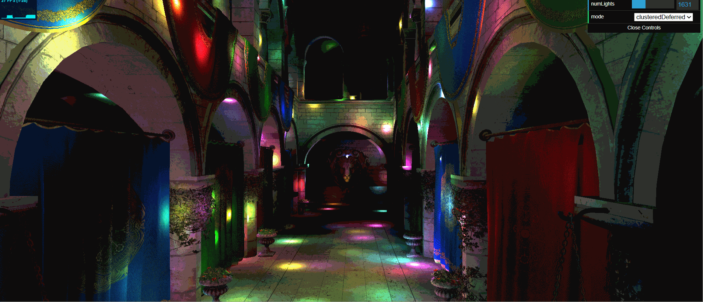
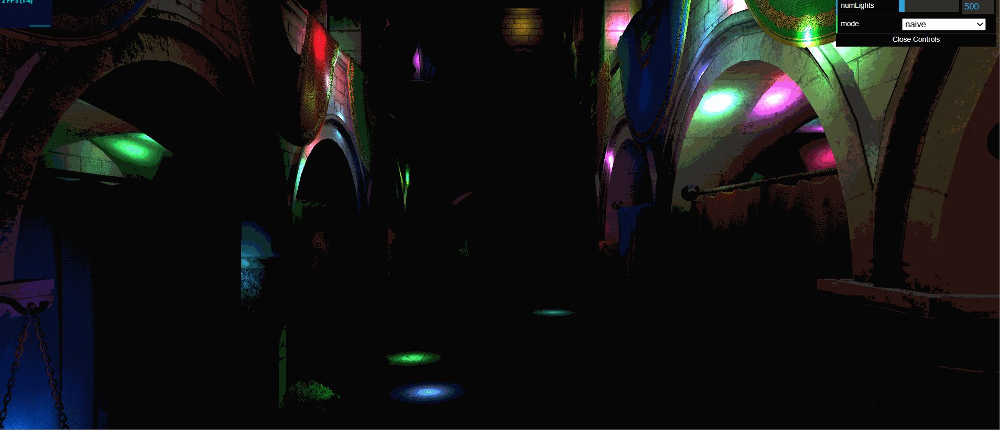
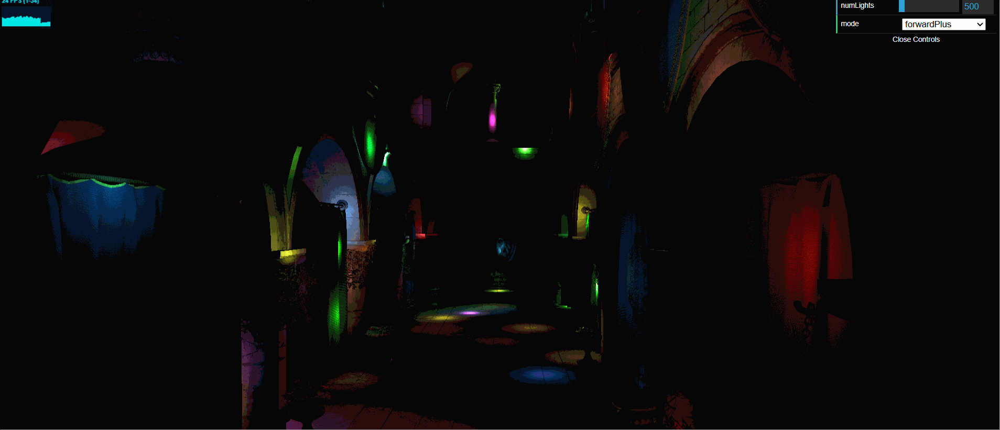
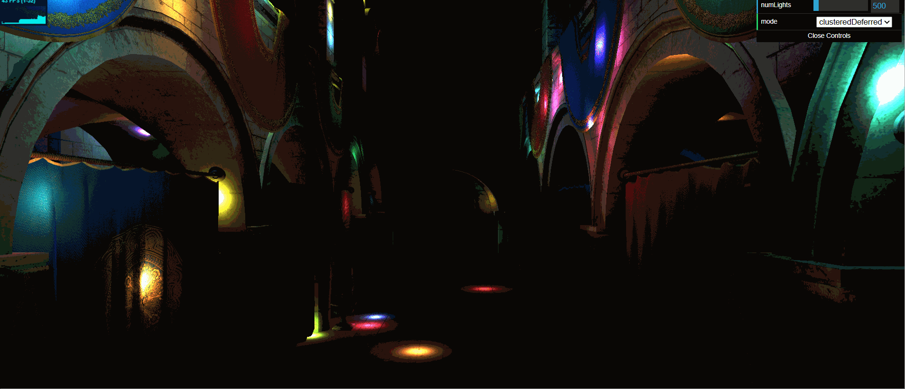

WebGL Forward+ and Clustered Deferred Shading
======================

**University of Pennsylvania, CIS 565: GPU Programming and Architecture, Project 4**

* Aaron Jiang
  * [LinkedIn](https://www.linkedin.com/in/aaronpjiang/), [Personal Website](https://aaron-jiang.com/)
* Tested on: Windows 11, i5-13420H @ 1.99GHz 16GB, GTX 4050 16MB (Personal Computer)

### Live Demo

### Demo Video/GIF

### Overview

This repo contains a demonstration of a variety of different rasterization methods in WebGPU. It contains implementations for a Naive Forward Renderer, a Clustered Forward+ Renderer, and a Clustered Deferred Renderer. The implementations were based on [this paper](https://www.cse.chalmers.se/~uffe/clustered_shading_preprint.pdf) by Ola Olsson, Markus Billeter, and Ulf Assarsson.

|Method | Demo|
|-|-|
|Naive ||
 | Clustered Forward+||
| Clustered Deferred| |

#### Naive Rendering
For every fragment in the render, we want to light it based on its distance to every light in the scene. In this demo, there are hundreds to thousands of lights, so naive is greatly disadvantaged as each fragment will have to check all lights.

#### Clustering
One way to lessen the amount of lights checked is by partitioning the view space into small frustums. The most straightforward way is to split your viewport into 2D tiles, which start at the camera and end at the far plane. However, if there are many lights in a row and geometry that varies heavily in depth, the fragments at the front of a tile will still have to check all the lights close to the tile near the far plane, which is unoptimal. So we can further split depth-wise the tiles into clusters. 

Here is a Debug View of the indices of each clusters. It is clear they are separated by depth, as well as screen space tiles.
| Tile Indices per Fragment|
|-|
|

#### Clustered Forward+
In Clustered Forward+, we compute the lights that reside in each tile using a compute shader. We get a array of indices that we can use to index into our light array and only sample those lights which are close enough for its falloff to intersect with the cluster's frustum.

#### Clustered Deferred
Another way of rendering is to record relavent data, like position, normal, and uv coordinates, into a geometry buffer, or GBuffer, and calculate the lighting in a secondary pass. This is called Deferred Rendering. In Clustered Deferred rendering, we again comptue the lights that reside in each tile using a compute shader. Then we dispatch a renderpass to render geometry data to the GBuffer, and then we do a lighting pass on each pixel of the GBuffer using only the lights that reside in its corresponding cluster.

### Performance Analysis
Here is the initial performance in frames per second for each rasterization method with 500 lights in the Sponza scene.

Clustered Deferred Rendering is the fastest of the three, followed by Clustered Forward+. This is expected, as Clustered Deferred does not suffer from Overdraw, which Clustered Forward+ does have to deal with.

I did some further optimizations which are shown below. Firstly, in my traversal code going through the lights in the cluster, I first grabbed the cluster `let cluster = computeOutput.clusters[id]`, and then used that variable to access each of the light indices in `cluster.lightIndices[i]`. However, this poses a large problem when I incrased the maximum number of lights in a cluster from 32 to 256. The shader code is now copying the whole array in each fragment, which slows it down. Calling from the whole array directly lowered the time for both Forward+ and Deferred, as shown below.

Secondly, I noticed my workgroup size was just 1. This is inefficient as workgroups can share resources, which I am not taking advantage of, and I am wasting warps. I increased the workgroup size to 8 by 8, which improved performance even further.

.png)

### Credits

- [Vite](https://vitejs.dev/)
- [loaders.gl](https://loaders.gl/)
- [dat.GUI](https://github.com/dataarts/dat.gui)
- [stats.js](https://github.com/mrdoob/stats.js)
- [wgpu-matrix](https://github.com/greggman/wgpu-matrix)
